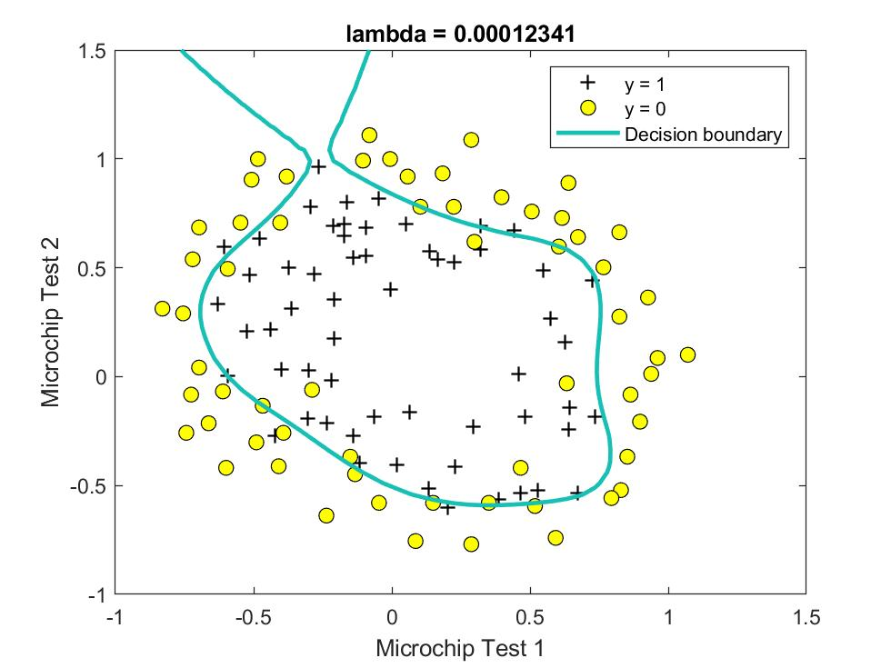
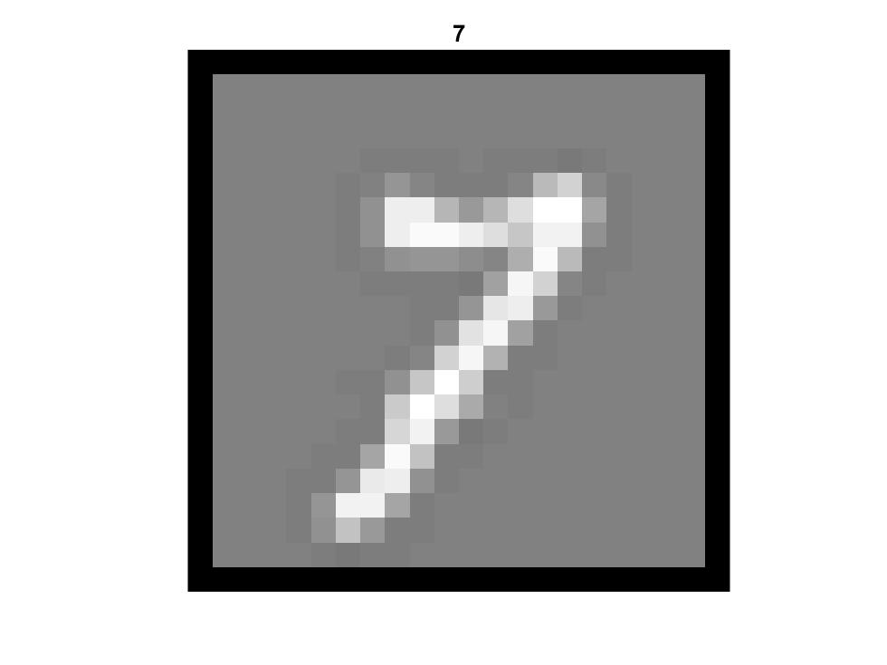

# Machine Learning with Octave/Matlab

[The credit for preparing the exercises goes to Andrew Ng of Stanford University and DeepLearning.ai through the Machine Learning course on Coursera. I have completed the exercises to complete the tasks.]

## sample1
This file will run samples to perform 
- Plotting Data
- Conputing Cost and Gradient descent
- Visualizing J(theta_0, theta_1)

For a given set of points we first plot the data points and then find a linear regression that minimizes the sum of the squares of distances (cost: least square) of the points from the line, using gradient descent. Then we will visulalize the cost function J.

Here is the cost as a function of y-intercept (theta_0) and the slope (theta_1) of the line:

And the contour lines with the minimum value found:

This is the output:

    Plotting Data ...
    Program paused. Press enter to continue.

    Testing the cost function ...
    With theta = [0 ; 0]
    Cost computed = 32.072734
    Expected cost value (approx) 32.07

    With theta = [-1 ; 2]
    Cost computed = 54.242455
    Expected cost value (approx) 54.24
    Program paused. Press enter to continue.

    Running Gradient Descent ...
    Theta found by gradient descent:
    -3.630291
    1.166362
    Expected theta values (approx)
     -3.6303
      1.1664

    For population = 35,000, we predict a profit of 4519.767868
    For population = 70,000, we predict a profit of 45342.450129
    Program paused. Press enter to continue.
    Visualizing J(theta_0, theta_1) ...

## sample1_multi
This file will run samples to perform 
- Feature Normalization
- Gradient Descent
- Normal Equations

Here we load a set of data of some features of houses and their prices. First, we will scale the features to normalize them, then run a gradient descent to minimize the cost function. And eventually compute the regression line directly to compare. At the end you can see the estimate for price of a house not in the data set.

Here you can see the cost vs. number of iterations. This is good way to check if our code is working correctly:

This is the output:

    Loading data ...
    First 10 examples from the dataset: 
     x = [2104 3], y = 399900 
     x = [1600 3], y = 329900 
     x = [2400 3], y = 369000 
     x = [1416 2], y = 232000 
     x = [3000 4], y = 539900 
     x = [1985 4], y = 299900 
     x = [1534 3], y = 314900 
     x = [1427 3], y = 198999 
     x = [1380 3], y = 212000 
     x = [1494 3], y = 242500 
    Program paused. Press enter to continue.
    Normalizing Features ...
    Running gradient descent ...
    Theta computed from gradient descent: 
     334302.063993 
     100087.116006 
     3673.548451 

    question =

       -0.4413   -0.2237

    Predicted price of a 1650 sq-ft, 3 br house (using gradient descent):
     $289314.620338
    Program paused. Press enter to continue.
    Solving with normal equations...
    Theta computed from the normal equations: 
     89597.909544 
     139.210674 
     -8738.019113 

    Predicted price of a 1650 sq-ft, 3 br house (using normal equations):
     $293081.464335

## sample2
This file will run samples to perform logistic regression. It includes:
- Plotting Data
- Compute Cost and Gradient
- Optimizing using fminunc
- Predict and Accuracies

Here we have data on students being admitted to a program and two test scores. We predict the probability that a student with some scores will get admitted or not. 

Here you can see the test scores and whether a student is admitted or not. Then, we have found a "cut-off line" and based or predicctions on which side of the line a new student will fall, based on their test scores. 

Then we predict for a student with scores 45 and 85, an admission probability of 0.776291, with train accuracy: 89%.

Here is the output:

	Plotting data with + indicating (y = 1) examples and o indicating (y = 0) examples.

	Program paused. Press enter to continue.
	Cost at initial theta (zeros): 0.693147
	Expected cost (approx): 0.693
	Gradient at initial theta (zeros): 
	 -0.100000 
	 -12.009217 
	 -11.262842 
	Expected gradients (approx):
	 -0.1000
	 -12.0092
	 -11.2628

	Cost at test theta: 0.218330
	Expected cost (approx): 0.218
	Gradient at test theta: 
	 0.042903 
	 2.566234 
	 2.646797 
	Expected gradients (approx):
	 0.043
	 2.566
	 2.647

	Program paused. Press enter to continue.

	Local minimum found.

	Optimization completed because the size of the gradient is less than
	the default value of the optimality tolerance.

	<stopping criteria details>

	Cost at theta found by fminunc: 0.203498
	Expected cost (approx): 0.203
	theta: 
	 -25.161343 
	 0.206232 
	 0.201472 
	Expected theta (approx):
	 -25.161
	 0.206
	 0.201

	Program paused. Press enter to continue.
	For a student with scores 45 and 85, we predict an admission probability of 0.776291
	Expected value: 0.775 +/- 0.002

	Train Accuracy: 89.000000
	Expected accuracy (approx): 89.0
	
## sample2_reg
This file will run samples to perform logistic regression with regularization. It includes:
- Regularized Logistic Regression
- Polynomial Features
- Regularization and Accuracies

Here we perform two tests on a set of microchips and we want to classify the microchips. The data looks like this:

Then we train a logistic regression algorithm with regulariziation paramter lambda to classify them. The change in lambda clearly shows the sensitivity of the algorithm for over/under fitting. Here are the decision boundaries for a few sample lambdas:

  

Here is the output for lambda = 1:

	Cost at initial theta (zeros): 0.693147
	Expected cost (approx): 0.693
	Gradient at initial theta (zeros) - first five values only:
	 0.008475 
	 0.018788 
	 0.000078 
	 0.050345 
	 0.011501 
	Expected gradients (approx) - first five values only:
	 0.0085
	 0.0188
	 0.0001
	 0.0503
	 0.0115

	Program paused. Press enter to continue.

	Cost at test theta (with lambda = 10): 3.164509
	Expected cost (approx): 3.16
	Gradient at test theta - first five values only:
	 0.346045 
	 0.161352 
	 0.194796 
	 0.226863 
	 0.092186 
	Expected gradients (approx) - first five values only:
	 0.3460
	 0.1614
	 0.1948
	 0.2269
	 0.0922

	Program paused. Press enter to continue.

	Local minimum found.

	Optimization completed because the size of the gradient is less than
	the default value of the optimality tolerance.

	<stopping criteria details>

	Train Accuracy: 83.050847
	Expected accuracy (with lambda = 1): 83.1 (approx)
	
## sample3
This file will run samples to perform one-vs-all classification to recognize handwritten digits. It includes:
- Visualizing Data
- Vectorize Logistic Regression
- One-vs-All Training
- Predict for One-Vs-All

Here we have access to MNIST dataset for handwritten digits, and the actual digit they represent. We write a logistic regression model to recognize these digits and perform a test to measure the accuracy of the trained model. The digits look like this:

And the training reaches 95% accuracy. You can see the recognized digits at the end of the output, below. Can you spot any errors?

Here is the output:

	Loading and Visualizing Data ...
	Program paused. Press enter to continue.

	Testing lrCostFunction() with regularization
	Cost: 2.534819
	Expected cost: 2.534819
	Gradients:
	 0.146561 
	 -0.548558 
	 0.724722 
	 1.398003 
	Expected gradients:
	 0.146561
	 -0.548558
	 0.724722
	 1.398003
	Program paused. Press enter to continue.

	Training One-vs-All Logistic Regression...
	Iteration     1 | Cost: 2.802128e-01
	Iteration     2 | Cost: 9.454389e-02
	Iteration     3 | Cost: 5.704641e-02
	Iteration     4 | Cost: 4.688190e-02
	[...]
	Iteration    48 | Cost: 1.006015e-02
	Iteration    49 | Cost: 9.986643e-03
	Iteration    50 | Cost: 9.975117e-03

	Program paused. Press enter to continue.

	Training Set Accuracy: 94.960000
	
	 2     2     9     2     9     9     7     0     1     2
     9     8     1     3     7     6     4     5     1     2
     6     8     6     3     6     8     5     1     2     6
     2     6     6     0     7     4     4     9     5     9
     2     6     4     3     1     8     6     5     1     3
     9     0     1     9     1     5     2     0     7     2
     9     2     9     0     6     0     0     7     8     6
     9     8     1     0     7     1     0     3     8     9
     0     8     9     5     0     1     7     5     2     4
     9     7     3     7     5     6     5     1     4     8
	

## sample3_nn
Here we reach the same goal usinga a pre-initialized neural network. This includes:
- Visualizing Data
- Loading Parameters
- Implementing Predict function

We use the same dataset as in sample3, and train a neural network to recognize the digits. Some of the outputs are shown here with the recognized digits on top. The training accuracy is about 97.5%.

  
  
  

Here is the output:

	Loading and Visualizing Data ...
	Program paused. Press enter to continue.

	Loading Saved Neural Network Parameters ...

	Training Set Accuracy: 97.520000
	Program paused. Press enter to continue.

	Displaying Example Image

	Neural Network Prediction: 10 (digit 0)
	Paused - press enter to continue, q to exit:q
	
# sample4
Here we train a neural network from scratch to recognize the handwritten digits. This includes:
- Visualizing Data
- Compute Cost (Feedforward)
- Regularization
- Sigmoid Gradient
- Initializing Pameters
- Backpropagation
- Training the Neural Network
- Visualizing Weights
- Predicting

Here is some randomly selected data points:

 

And here is a visualization of a hidden layer of our neural network:

 

You can see the recognized digits at the end of the output below. Do you spot any errors?

	Loading and Visualizing Data ...
	Program paused. Press enter to continue.

	Loading Saved Neural Network Parameters ...

	Feedforward Using Neural Network ...
	Cost at parameters (loaded from ex4weights): 0.287629 
	(this value should be about 0.287629)

	Program paused. Press enter to continue.

	Checking Cost Function (w/ Regularization) ... 
	Cost at parameters (loaded from ex4weights): 0.383770 
	(this value should be about 0.383770)
	Program paused. Press enter to continue.

	Evaluating sigmoid gradient...
	Sigmoid gradient evaluated at [-1 -0.5 0 0.5 1]:
	  0.196612 0.235004 0.250000 0.235004 0.196612 

	Program paused. Press enter to continue.

	Initializing Neural Network Parameters ...

	Checking Backpropagation... 
	   -0.0093   -0.0093
		0.0089    0.0089
	   [...]
		0.0532    0.0532
		0.0466    0.0466

	The above two columns you get should be very similar.
	(Left-Your Numerical Gradient, Right-Analytical Gradient)

	If your backpropagation implementation is correct, then 
	the relative difference will be small (less than 1e-9). 

	Relative Difference: 2.37276e-11

	Program paused. Press enter to continue.

	Checking Backpropagation (w/ Regularization) ... 
	   -0.0093   -0.0093
		0.0089    0.0089
	   [...]
	   -0.0045   -0.0045
		0.0015    0.0015

	The above two columns you get should be very similar.
	(Left-Your Numerical Gradient, Right-Analytical Gradient)

	If your backpropagation implementation is correct, then 
	the relative difference will be small (less than 1e-9). 

	Relative Difference: 2.26976e-11

	Cost at (fixed) debugging parameters (w/ lambda = 3.000000): 0.576051 
	(for lambda = 3, this value should be about 0.576051)

	Program paused. Press enter to continue.

	Training Neural Network... 
	Iteration     1 | Cost: 3.343740e+00
	Iteration     2 | Cost: 3.235767e+00
	[...]
	Iteration    49 | Cost: 3.323207e-01
	Iteration    50 | Cost: 3.246657e-01

	Program paused. Press enter to continue.

	Visualizing Neural Network... 

	Program paused. Press enter to continue.

	Training Set Accuracy: 96.320000

	ans =

		 6     8     6     3     5     3     8     2     2     3
		 7     0     6     1     8     6     4     8     6     1
		 1     7     1     7     2     6     2     8     0     7
		 5     0     1     9     1     5     0     4     5     8
		 7     1     2     4     2     3     2     0     6     6
		 2     2     6     3     8     2     2     6     1     3
		 7     4     2     7     4     0     6     0     4     9
		 8     9     5     9     8     9     5     5     2     2
		 5     6     3     0     9     1     8     3     0     2
		 2     2     5     1     6     8     9     5     0     5
		 
 