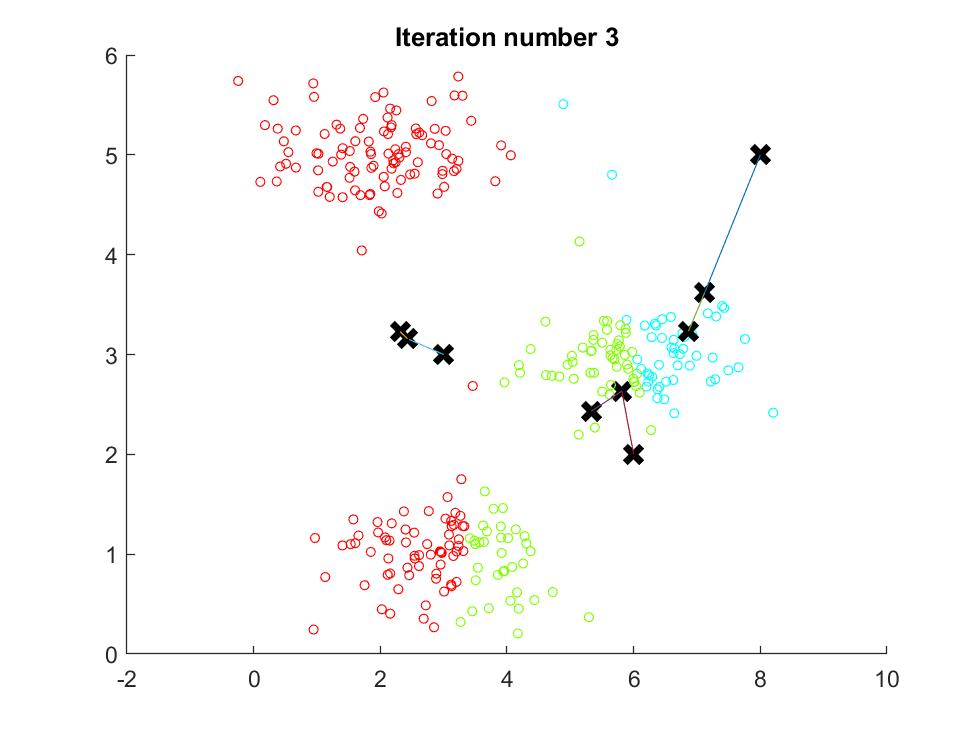
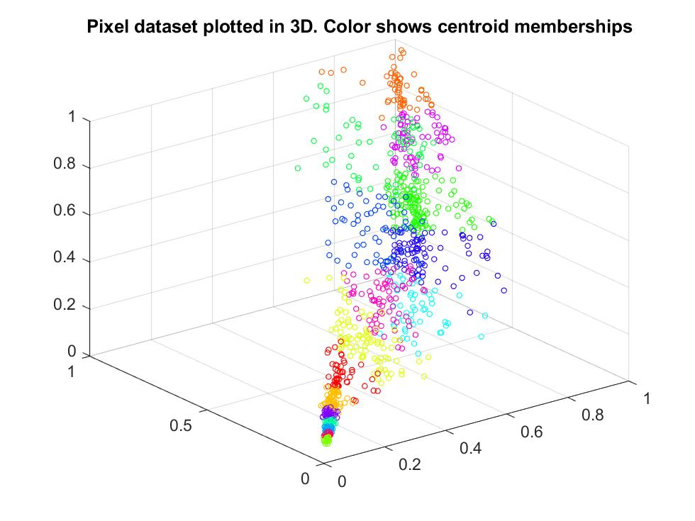

# Machine Learning with Octave/Matlab

## Contents:
- [sample1](#sample1)
	- Linear Regression
	- Gradient Descent
	- Minimizing Cost Function
- [sample1_multi](#sample1_multi)
	- Feature Normalization
    - Gradient Descent
    - Normal Equations
- [sample2](#sample2)
	- Logistic Regression
    - Plotting Data
    - Compute Cost and Gradient
    - Optimizing using fminunc
    - Predict and Accuracies
- [sample2_reg](#sample2_reg)
	- Regularized Logistic Regression
    - Polynomial Features
    - Regularization and Accuracies
- [sample3](#sample3)
	- One-vs-all Classification
	- Visualizing Data
    - Vectorize Logistic Regression
    - One-vs-All Training
    - Predict for One-Vs-All
- [sample3_nn](#sample3_nn)
	- Preloaded Neural Network - Handwriting recognition
	- Visualizing Data
    - Loading Parameters
    - Implementing Predict function
- [sample4](#sample4)
	- Neural Networks From Scratch
    - Visualizing Data
    - Compute Cost (Feedforward)
    - Regularization
    - Sigmoid Gradient
    - Initializing Pameters
    - Backpropagation
    - Training the Neural Network
    - Visualizing Weights
    - Predicting
- [sample5](#sample5)
	- Polynomial fitting and Learning Curves
    - Visualizing Data
    - Regularized Linear Regression Cost
    - Regularized Linear Regression Gradient
    - Learning Curve for Linear Regression
    - Feature Mapping for Polynomial Regression
    - Learning Curve for Polynomial Regression
    - Validation for Selecting Lambda
- [sample6](#sample6)
	- Support Vector Machines
    - Visualizing Data
    - Training Linear SVM
    - Implementing Gaussian Kernel
    - Training SVM with RBF Kernel
- [sample6_spam](#sample6_spam)
	- Spam Classifier
    - Email Preprocessing
    - Feature Extraction
    - Training Linear SVM for Spam Classification
    - Testing Spam Classification
    - Identifying top Predictors of Spam (check this out in the output, below)
    - Trying our Own Emails
- [sample7](#sample7)
	- K-means Custering and Image Compression
    - Find Closest Centroids
    - Compute Means
    - K-Means Clustering
    - K-Means Clustering on Pixels
    - Image Compression
- [sample7_pca](#sample7_pca)
	- Principal Component Analysis and Dimensionality Reduction
    - Visualizing Dataset
    - Principal Component Analysis
    - Dimension Reduction
    - Visualizing Face Data
    - PCA on Face Data: Eigenfaces
    - Dimension Reduction for Faces
    - Visualization of Faces after PCA Dimension Reduction
    - PCA for Visualization
- [sample8](#sample8)
	- Anomaly Detection
    - Estimateing the dataset statistics
    - Finding Outliers
    - Multidimensional Outliers
- [sample8_cofi](#sample8_cofi)
	- Collaborative Filtering and Recommender Sytstems
    - Visualizing Movie Ratings Dataset
    - Collaborative Filtering Cost, Gradient, and their Regularization
    - Entering ratings for a new user
    - Learning Movie Ratings
    - Recommendation

[The credit for preparing the exercises goes to Andrew Ng of Stanford University and DeepLearning.ai through the Machine Learning course on Coursera. I have completed the exercises to complete the tasks.]

## sample1 
In this sample we perform a linear regression by minimizing the cost function. It includes:
- Plotting Data
- Computing Cost and Gradient descent
- Visualizing Cost Function

For a given set of points we first plot the data points and then find a linear regression that minimizes the sum of the squares of distances (cost: least square) of the points from the line, using gradient descent. Then we will visulalize the cost function J.

Here is the cost as a function of y-intercept (theta_0) and the slope (theta_1) of the line:

And the contour lines with the minimum value found:

This is the output:

    Plotting Data ...
    Program paused. Press enter to continue.

    Testing the cost function ...
    With theta = [0 ; 0]
    Cost computed = 32.072734
    Expected cost value (approx) 32.07

    With theta = [-1 ; 2]
    Cost computed = 54.242455
    Expected cost value (approx) 54.24
    Program paused. Press enter to continue.

    Running Gradient Descent ...
    Theta found by gradient descent:
    -3.630291
    1.166362
    Expected theta values (approx)
     -3.6303
      1.1664

    For population = 35,000, we predict a profit of 4519.767868
    For population = 70,000, we predict a profit of 45342.450129
    Program paused. Press enter to continue.
    Visualizing J(theta_0, theta_1) ...

## sample1_multi 
This file will run samples to estimate the price of a house based on some features. It includes
- Feature Normalization
- Gradient Descent
- Normal Equations

Here we load a set of data of some features of houses and their prices. First, we will scale the features to normalize them, then run a gradient descent to minimize the cost function. And eventually compute the regression line directly to compare. At the end you can see the estimate for price of a house not in the data set.

Here you can see the cost vs. number of iterations. This is good way to check if our code is working correctly:

This is the output:

    Loading data ...
    First 10 examples from the dataset: 
     x = [2104 3], y = 399900 
     x = [1600 3], y = 329900 
     x = [2400 3], y = 369000 
     x = [1416 2], y = 232000 
     x = [3000 4], y = 539900 
     x = [1985 4], y = 299900 
     x = [1534 3], y = 314900 
     x = [1427 3], y = 198999 
     x = [1380 3], y = 212000 
     x = [1494 3], y = 242500 
    Program paused. Press enter to continue.
    Normalizing Features ...
    Running gradient descent ...
    Theta computed from gradient descent: 
     334302.063993 
     100087.116006 
     3673.548451 

    question =

       -0.4413   -0.2237

    Predicted price of a 1650 sq-ft, 3 br house (using gradient descent):
     $289314.620338
    Program paused. Press enter to continue.
    Solving with normal equations...
    Theta computed from the normal equations: 
     89597.909544 
     139.210674 
     -8738.019113 

    Predicted price of a 1650 sq-ft, 3 br house (using normal equations):
     $293081.464335

## sample2 
This file will run samples to perform logistic regression. It includes:
- Plotting Data
- Compute Cost and Gradient
- Optimizing using fminunc
- Predict and Accuracies

Here we have data on students being admitted to a program and two test scores. We predict the probability that a student with some scores will get admitted or not. 

Here you can see the test scores and whether a student is admitted or not. Then, we have found a "cut-off line" and based or predicctions on which side of the line a new student will fall, based on their test scores. 

Then we predict for a student with scores 45 and 85, an admission probability of 0.776291, with train accuracy: 89%.

Here is the output:

	Plotting data with + indicating (y = 1) examples and o indicating (y = 0) examples.

	Program paused. Press enter to continue.
	Cost at initial theta (zeros): 0.693147
	Expected cost (approx): 0.693
	Gradient at initial theta (zeros): 
	 -0.100000 
	 -12.009217 
	 -11.262842 
	Expected gradients (approx):
	 -0.1000
	 -12.0092
	 -11.2628

	Cost at test theta: 0.218330
	Expected cost (approx): 0.218
	Gradient at test theta: 
	 0.042903 
	 2.566234 
	 2.646797 
	Expected gradients (approx):
	 0.043
	 2.566
	 2.647

	Program paused. Press enter to continue.

	Local minimum found.

	Optimization completed because the size of the gradient is less than
	the default value of the optimality tolerance.

	<stopping criteria details>

	Cost at theta found by fminunc: 0.203498
	Expected cost (approx): 0.203
	theta: 
	 -25.161343 
	 0.206232 
	 0.201472 
	Expected theta (approx):
	 -25.161
	 0.206
	 0.201

	Program paused. Press enter to continue.
	For a student with scores 45 and 85, we predict an admission probability of 0.776291
	Expected value: 0.775 +/- 0.002

	Train Accuracy: 89.000000
	Expected accuracy (approx): 89.0
	
## sample2_reg 
This file will run samples to perform logistic regression with regularization. It includes:
- Regularized Logistic Regression
- Polynomial Features
- Regularization and Accuracies

Here we perform two tests on a set of microchips and we want to classify the microchips. The data looks like this:

Then we train a logistic regression algorithm with regulariziation paramter lambda to classify them. The change in lambda clearly shows the sensitivity of the algorithm for over/under fitting. Here are the decision boundaries for a few sample lambdas:

  

Here is the output for lambda = 1:

	Cost at initial theta (zeros): 0.693147
	Expected cost (approx): 0.693
	Gradient at initial theta (zeros) - first five values only:
	 0.008475 
	 0.018788 
	 0.000078 
	 0.050345 
	 0.011501 
	Expected gradients (approx) - first five values only:
	 0.0085
	 0.0188
	 0.0001
	 0.0503
	 0.0115

	Program paused. Press enter to continue.

	Cost at test theta (with lambda = 10): 3.164509
	Expected cost (approx): 3.16
	Gradient at test theta - first five values only:
	 0.346045 
	 0.161352 
	 0.194796 
	 0.226863 
	 0.092186 
	Expected gradients (approx) - first five values only:
	 0.3460
	 0.1614
	 0.1948
	 0.2269
	 0.0922

	Program paused. Press enter to continue.

	Local minimum found.

	Optimization completed because the size of the gradient is less than
	the default value of the optimality tolerance.

	<stopping criteria details>

	Train Accuracy: 83.050847
	Expected accuracy (with lambda = 1): 83.1 (approx)
	
## sample3 
This file will run samples to perform one-vs-all classification to recognize handwritten digits. It includes:
- Visualizing Data
- Vectorize Logistic Regression
- One-vs-All Training
- Predict for One-Vs-All

Here we have access to MNIST dataset for handwritten digits, and the actual digit they represent. We write a logistic regression model to recognize these digits and perform a test to measure the accuracy of the trained model. The digits look like this:

And the training reaches 95% accuracy. You can see the recognized digits at the end of the output, below. Can you spot any errors?

Here is the output:

	Loading and Visualizing Data ...
	Program paused. Press enter to continue.

	Testing lrCostFunction() with regularization
	Cost: 2.534819
	Expected cost: 2.534819
	Gradients:
	 0.146561 
	 -0.548558 
	 0.724722 
	 1.398003 
	Expected gradients:
	 0.146561
	 -0.548558
	 0.724722
	 1.398003
	Program paused. Press enter to continue.

	Training One-vs-All Logistic Regression...
	Iteration     1 | Cost: 2.802128e-01
	Iteration     2 | Cost: 9.454389e-02
	Iteration     3 | Cost: 5.704641e-02
	Iteration     4 | Cost: 4.688190e-02
	[...]
	Iteration    48 | Cost: 1.006015e-02
	Iteration    49 | Cost: 9.986643e-03
	Iteration    50 | Cost: 9.975117e-03

	Program paused. Press enter to continue.

	Training Set Accuracy: 94.960000
	
	 2     2     9     2     9     9     7     0     1     2
     9     8     1     3     7     6     4     5     1     2
     6     8     6     3     6     8     5     1     2     6
     2     6     6     0     7     4     4     9     5     9
     2     6     4     3     1     8     6     5     1     3
     9     0     1     9     1     5     2     0     7     2
     9     2     9     0     6     0     0     7     8     6
     9     8     1     0     7     1     0     3     8     9
     0     8     9     5     0     1     7     5     2     4
     9     7     3     7     5     6     5     1     4     8
	

## sample3_nn 
Here we reach the same goal usinga a pre-initialized neural network. This includes:
- Visualizing Data
- Loading Parameters
- Implementing Predict function

We use the same dataset as in sample3, and train a neural network to recognize the digits. Some of the outputs are shown here with the recognized digits on top. The training accuracy is about 97.5%.

  
  
  

Here is the output:

	Loading and Visualizing Data ...
	Program paused. Press enter to continue.

	Loading Saved Neural Network Parameters ...

	Training Set Accuracy: 97.520000
	Program paused. Press enter to continue.

	Displaying Example Image

	Neural Network Prediction: 10 (digit 0)
	Paused - press enter to continue, q to exit:q
	
## sample4 
Here we train a neural network from scratch to recognize the handwritten digits. This includes:
- Visualizing Data
- Compute Cost (Feedforward)
- Regularization
- Sigmoid Gradient
- Initializing Pameters
- Backpropagation
- Training the Neural Network
- Visualizing Weights
- Predicting

Here is some randomly selected data points:

 

And here is a visualization of a hidden layer of our neural network (Don't ask me!):

 

You can see the recognized digits at the end of the output below. Do you spot any errors?

	Loading and Visualizing Data ...
	Program paused. Press enter to continue.

	Loading Saved Neural Network Parameters ...

	Feedforward Using Neural Network ...
	Cost at parameters (loaded from ex4weights): 0.287629 
	(this value should be about 0.287629)

	Program paused. Press enter to continue.

	Checking Cost Function (w/ Regularization) ... 
	Cost at parameters (loaded from ex4weights): 0.383770 
	(this value should be about 0.383770)
	Program paused. Press enter to continue.

	Evaluating sigmoid gradient...
	Sigmoid gradient evaluated at [-1 -0.5 0 0.5 1]:
	  0.196612 0.235004 0.250000 0.235004 0.196612 

	Program paused. Press enter to continue.

	Initializing Neural Network Parameters ...

	Checking Backpropagation... 
	   -0.0093   -0.0093
		0.0089    0.0089
	   [...]
		0.0532    0.0532
		0.0466    0.0466

	The above two columns you get should be very similar.
	(Left-Your Numerical Gradient, Right-Analytical Gradient)

	If your backpropagation implementation is correct, then 
	the relative difference will be small (less than 1e-9). 

	Relative Difference: 2.37276e-11

	Program paused. Press enter to continue.

	Checking Backpropagation (w/ Regularization) ... 
	   -0.0093   -0.0093
		0.0089    0.0089
	   [...]
	   -0.0045   -0.0045
		0.0015    0.0015

	The above two columns you get should be very similar.
	(Left-Your Numerical Gradient, Right-Analytical Gradient)

	If your backpropagation implementation is correct, then 
	the relative difference will be small (less than 1e-9). 

	Relative Difference: 2.26976e-11

	Cost at (fixed) debugging parameters (w/ lambda = 3.000000): 0.576051 
	(for lambda = 3, this value should be about 0.576051)

	Program paused. Press enter to continue.

	Training Neural Network... 
	Iteration     1 | Cost: 3.343740e+00
	Iteration     2 | Cost: 3.235767e+00
	[...]
	Iteration    49 | Cost: 3.323207e-01
	Iteration    50 | Cost: 3.246657e-01

	Program paused. Press enter to continue.

	Visualizing Neural Network... 

	Program paused. Press enter to continue.

	Training Set Accuracy: 96.320000

	ans =

		 6     8     6     3     5     3     8     2     2     3
		 7     0     6     1     8     6     4     8     6     1
		 1     7     1     7     2     6     2     8     0     7
		 5     0     1     9     1     5     0     4     5     8
		 7     1     2     4     2     3     2     0     6     6
		 2     2     6     3     8     2     2     6     1     3
		 7     4     2     7     4     0     6     0     4     9
		 8     9     5     9     8     9     5     5     2     2
		 5     6     3     0     9     1     8     3     0     2
		 2     2     5     1     6     8     9     5     0     5
		 
## sample5 
Here we fit a polynomial model to our data. This includes:
- Visualizing Data
- Regularized Linear Regression Cost
- Regularized Linear Regression Gradient
- Learning Curve for Linear Regression
- Feature Mapping for Polynomial Regression
- Learning Curve for Polynomial Regression
- Validation for Selecting Lambda

In this sample we analyse the bias and variance of our model. We start with a dataset of amount of waterflow out of a dam vs. the change in water levels. First step is to fit a line to the data, and of course it is not a good fit:

 

Then we implement a polynomial model and using validation curves check whether increasing number of examples will make our model better.

 

Next, we fit a polynomial to the data with regularization parameter lambda = 0:

 

And analyse the bias/variance again using the learning curve:

 

Finally, we vary the lambda and check the training error and the cross validation error to choose the best lambda:

 

In this figure, we can see that the best value of lambda is around 3.

And here is the output:

	Loading and Visualizing Data ...
	Program paused. Press enter to continue.
	Cost at theta = [1 ; 1]: 303.993192 
	(this value should be about 303.993192)
	Program paused. Press enter to continue.
	Gradient at theta = [1 ; 1]:  [-15.303016; 598.250744] 
	(this value should be about [-15.303016; 598.250744])
	Program paused. Press enter to continue.
	Iteration     1 | Cost: 1.052435e+02
	Iteration     2 | Cost: 2.237391e+01

	Program paused. Press enter to continue.
	Iteration     1 | Cost: 2.663868e-01
	Iteration     2 | Cost: 3.944305e-31
	[...]
	Iteration    16 | Cost: 2.431725e+01
	Iteration    17 | Cost: 2.431725e+01

	Iteration     1 | Cost: 1.052435e+02
	Iteration     2 | Cost: 2.237391e+01

	# Training Examples	Train Error	Cross Validation Error
		1		0.000000	205.121096
		2		0.000000	110.300366
		3		3.286595	45.010231
		4		2.842678	48.368911
		5		13.154049	35.865165
		6		19.443963	33.829962
		7		20.098522	31.970986
		8		18.172859	30.862446
		9		22.609405	31.135998
		10		23.261462	28.936207
		11		24.317250	29.551432
		12		22.373906	29.433818
	Program paused. Press enter to continue.
	Normalized Training Example 1:
	  1.000000  
	  -0.362141  
	  -0.755087  
	  0.182226  
	  -0.706190  
	  0.306618  
	  -0.590878  
	  0.344516  
	  -0.508481  

	Program paused. Press enter to continue.
	Iteration     1 | Cost: 8.273077e+01
	Iteration     2 | Cost: 2.687496e+01
	[...]
	Iteration   199 | Cost: 1.489243e-01
	Iteration   200 | Cost: 1.482768e-01

	Polynomial Regression (lambda = 0.000000)

	# Training Examples	Train Error	Cross Validation Error
		1		0.000000	160.721900
		2		0.000000	160.121510
		3		0.000000	61.754825
		4		0.000000	61.928895
		5		0.000000	6.601010
		6		0.000368	10.313829
		7		0.013763	20.062804
		8		0.071330	6.432137
		9		0.116034	8.020411
		10		0.174462	9.137928
		11		0.162821	8.138874
		12		0.148277	17.936337
	Program paused. Press enter to continue.
	Iteration     1 | Cost: 8.273077e+01
	Iteration     2 | Cost: 2.687496e+01
	[...]
	Iteration    17 | Cost: 3.337220e+01
	Iteration    18 | Cost: 3.337220e+01

	lambda		Train Error	Validation Error
	 0.000000	0.148277	17.936337
	 0.001000	0.179513	20.422101
	 0.003000	0.179920	17.690758
	 0.010000	0.221774	16.888024
	 0.030000	0.281851	12.828700
	 0.100000	0.459318	7.587014
	 0.300000	0.921760	4.636833
	 1.000000	2.076188	4.260625
	 3.000000	4.901351	3.822907
	 10.000000	16.092213	9.945509
	Program paused. Press enter to continue.
	
## sample6 
We use support vector machines(SVMs) with various 2D datasets. We will demonstrate how to use a Gaussian
kernel with SVMs. This includes:
- Visualizing Data
- Training Linear SVM 
- Implementing Gaussian Kernel
- Training SVM with RBF Kernel

The first dataset is 2 dimensional and can be separated by a linear boundary.

 

In this dataset, the positions of the positive examples (indicated with +) and the negative examples (indicated with o) suggest a natural separation indicated by the gap. However, there is an outlier positive example + on the far left at about (0:1; 4:1). We use a parameter C for the SVM in this code. Informally, the C parameter is a positive value that controls the penalty for misclassified training examples. A large C parameter tells the SVM to try to classify all the examples correctly. C plays a role similar to 1/lambda, where lambda is the regularization parameter that we were using for logistic regression. The figure above is with C = 1. A larger C will find a more skewed line that puts all the positive examples on one side of the line.

Next, we use SVMs to do non-linear classification. In particular, we use SVMs with Gaussian kernels on datasets that are not linearly separable.

 

Gaussian kernel are a similarity function that measures the distance between a pair of examples, x(i) and x(j). The Gaussian kernel is also parameterized by a bandwidth parameter, sigma, which determines how fast the similarity metric decreases (to 0) as the examples are further apart. The Gassian Kernel is defined as

 

Finally, we use the cross validation set to determine the best C and sigma parameter to use to find a non-linear boundary. The best result is shown here:

 

And here is the output:

	Loading and Visualizing Data ...
	Program paused. Press enter to continue.

	Training Linear SVM ...

	Training ......................................................................
	... Done! 

	Program paused. Press enter to continue.

	Evaluating the Gaussian Kernel ...
	Gaussian Kernel between x1 = [1; 2; 1], x2 = [0; 4; -1], sigma = 2.000000 :
		0.324652
	(for sigma = 2, this value should be about 0.324652)
	Program paused. Press enter to continue.
	Loading and Visualizing Data ...
	Program paused. Press enter to continue.

	Training SVM with RBF Kernel (this may take 1 to 2 minutes) ...

	Training ......................................................................
	[...]
	... Done! 

	Program paused. Press enter to continue.
	Loading and Visualizing Data ...
	Program paused. Press enter to continue.

	Training ......... Done! 

	Training ......................................................................
	[...]
	...................... Done! 

	Program paused. Press enter to continue.
	
	
## sample6_spam 
Here we will use the support vector machines created above to build a spam classifier. We first convert each
email into a feature vector x in R^n. This includes:
- Email Preprocessing
- Feature Extraction
- Training Linear SVM for Spam Classification
- Testing Spam Classification
- Identifying top Predictors of Spam (check this out in the output, below)
- Trying our Own Emails

The method employed here in processing emails is to normalize dollar values and URLs, so that all URLs are treated the same, all numbers are treated the same, etc. For example, we replace each URL in the email with the unique string `httpaddr` to indicate that a URL was present. This has the effect of letting the spam classifier make a classification decision based on whether any URL was present, rather than whether a specific URL was present. This typically improves the performance of a spam classifier, since spammers often randomize the URLs, and thus the odds of seeing any particular URL again in a new piece of spam is very small.

The code `processEmail.m` does the following preprocessings:
- Lower-casing
- Stripping HTML
- Normalizing URLs
- Normalizing Email Addresses
- Normalizing Numbers
- Normalizing Dollars
- Word Stemming
- Removal of non-words

Here is the output:

	Preprocessing sample email (emailSample1.txt)

	==== Processed Email ====

	anyon know how much it cost to host a web portal well it depend on how mani 
	visitor you re expect thi can be anywher from less than number buck a month 
	to a coupl of dollarnumb you should checkout httpaddr or perhap amazon ecnumb 
	if your run someth big to unsubscrib yourself from thi mail list send an 
	email to emailaddr 

	=========================
	Word Indices: 
	 86 916 794 1077 883 370 1699 790 1822 1831 883 431 1171 794 1002 1893 1364 592 1676 238 162 89 688 945 1663 1120 1062 1699 375 1162 479 1893 1510 799 1182 1237 810 1895 1440 1547 181 1699 1758 1896 688 1676 992 961 1477 71 530 1699 531

	Program paused. Press enter to continue.

	Extracting features from sample email (emailSample1.txt)

	==== Processed Email ====

	anyon know how much it cost to host a web portal well it depend on how mani 
	visitor you re expect thi can be anywher from less than number buck a month 
	to a coupl of dollarnumb you should checkout httpaddr or perhap amazon ecnumb 
	if your run someth big to unsubscrib yourself from thi mail list send an 
	email to emailaddr 

	=========================
	Length of feature vector: 1899
	Number of non-zero entries: 45
	Program paused. Press enter to continue.

	Training Linear SVM (Spam Classification)
	(this may take 1 to 2 minutes) ...

	Training ......................................................................
	...............................................................................
	...............................................................................
	................................................................... Done! 

	Training Accuracy: 99.850000

	Evaluating the trained Linear SVM on a test set ...
	Test Accuracy: 98.900000

	Top predictors of spam: 
	 our             (0.505201) 
	 click           (0.465314) 
	 remov           (0.418803) 
	 guarante        (0.384257) 
	 visit           (0.369447) 
	 basenumb        (0.349145) 
	 dollar          (0.334123) 
	 will            (0.271586) 
	 price           (0.266497) 
	 pleas           (0.262485) 
	 most            (0.258954) 
	 lo              (0.256912) 
	 nbsp            (0.248506) 
	 ga              (0.247400) 
	 da              (0.239843) 

	Program paused. Press enter to continue.

	==== Processed Email ====

	do you want to make dollarnumb or more per week if you ar a motiv and qualifi 
	individu i will person demonstr to you a system that will make you dollarnumb 
	number per week or more thi is not mlm call our number hour pre record number 
	to get the detail number number number i need peopl who want to make seriou 
	monei make the call and get the fact invest number minut in yourself now 
	number number number look forward to your call and i will introduc you to 
	peopl like yourself who ar current make dollarnumb number plu per week number 
	number number numberljgvnumb numberleannumberlrmsnumb 
	numberwxhonumberqiytnumb numberrjuvnumberhqcfnumb numbereidbnumberdmtvlnumb 

	=========================

	Processed spamSample1.txt

	Spam Classification: 1
	(1 indicates spam, 0 indicates not spam)

## sample7  
In this sample we implement k-means clustering and then use it to compress an image. This includes:
- Find Closest Centroids
- Compute Means
- K-Means Clustering
- K-Means Clustering on Pixels
- Image Compression

First we use a set of 2D points to test out our k-means clustering algorithm. Here we can see the results step-by-step (only 10 steps are shown):

     
     

Then we use the algorithm to cluster pixels in a photo that have RGB values close to each other, and use that clustering to compress the image. Here is the result:

 

And here is the output:

	Finding closest centroids.

	Closest centroids for the first 3 examples: 
	 1 3 2
	(the closest centroids should be 1, 3, 2 respectively)
	Program paused. Press enter to continue.

	Computing centroids means.

	Centroids computed after initial finding of closest centroids: 
	 2.428301 3.157924 
	 5.813503 2.633656 
	 7.119387 3.616684 

	(the centroids should be
	   [ 2.428301 3.157924 ]
	   [ 5.813503 2.633656 ]
	   [ 7.119387 3.616684 ]

	Program paused. Press enter to continue.

	Running K-Means clustering on example dataset.

	K-Means iteration 1/10...
	Press enter to continue.
	[...]
	K-Means iteration 10/10...
	Press enter to continue.

	K-Means Done.

	Program paused. Press enter to continue.

	Running K-Means clustering on pixels from an image.

	K-Means iteration 1/10...
	[...]
	K-Means iteration 10/10...
	Program paused. Press enter to continue.

	Applying K-Means to compress an image.

	Program paused. Press enter to continue.

## sample7_pca 
In this sample we first use the Principal Component Analysis to reduce dimension of data. Then we will use it on an image to reduce its size. This includes:
- Visualizing Dataset
- Principal Component Analysis
- Dimension Reduction
- Visualizing Face Data
- PCA on Face Data: Eigenfaces
- Dimension Reduction for Faces
- Visualization of Faces after PCA Dimension Reduction
- PCA for Visualization

We first start with a 2D dataset, and plot its two eigenvectors at their mean. The longer eigenvector shows most of the data is in that direction, so to reduce the dimensionality, we can ignore the direction of the shorter one:

 
 
This can be achieved by projecting the points onto the longer eigenvector:

Now this technique can be used to reduce dimension of pictures. For example, consider the following dataset of faces:

We can compute the eigenvectors (eigenfaces!) of this dataset. Below the top 36 are shown:

Now we can reduce the dimension of all of the faces in the above by projecting them onto these directions:

Same method can be applied on any data set. For example the parrot in the previous sample. Here are all the RGB values of its pixels:

We can reduce the image by projecting them into two dimensions:

Finally, here is the output:
	
	Visualizing example dataset for PCA.

	Program paused. Press enter to continue.

	Running PCA on example dataset.

	Top eigenvector: 
	 U(:,1) = -0.707107 -0.707107 

	(you should expect to see -0.707107 -0.707107)
	Program paused. Press enter to continue.

	Dimension reduction on example dataset.

	Projection of the first example: 1.481274

	(this value should be about 1.481274)

	Approximation of the first example: -1.047419 -1.047419

	(this value should be about  -1.047419 -1.047419)

	Program paused. Press enter to continue.

	Loading face dataset.

	Program paused. Press enter to continue.

	Running PCA on face dataset.
	(this might take a minute or two ...)

	Program paused. Press enter to continue.

	Dimension reduction for face dataset.

	The projected data Z has a size of: 5000 100 

	Program paused. Press enter to continue.

	Visualizing the projected (reduced dimension) faces.

	Program paused. Press enter to continue.

	K-Means iteration 1/10...
	K-Means iteration 2/10...
	K-Means iteration 3/10...
	K-Means iteration 4/10...
	K-Means iteration 5/10...
	K-Means iteration 6/10...
	K-Means iteration 7/10...
	K-Means iteration 8/10...
	K-Means iteration 9/10...
	K-Means iteration 10/10...
	Program paused. Press enter to continue.
	Program paused. Press enter to continue.

## sample8 
In this sample we implement anomaly detection algorithms and collaborative filtering. It includes:
- Estimateing the dataset statistics
- Finding Outliers
- Multidimensional Outliers

The first dataset includes two network server statistics across several machines: the latency and throughput of each machine. With anomaly detection, we find possibly faulty (or very fast) machines.

Assuming a Gaussian distribution for our dataset, we first estimate the parameters the distribution, then compute the probabilities for each of the points and then visualize both the overall distribution and where each of the points falls in terms of that distribution.

Then we find a good epsilon threshold using a cross-validation set probabilities given the estimated Gaussian distribution.

Finally, we apply this to a harder problem in which more features describe each datapoint and only some features indicate whether a point is an outlier. In this dataset, each example is described by 11 features, capturing many more properties of the servers. At the end epsilon is about 1.38e-18, and 117 anomalies are found.

Here is the output:

	Visualizing example dataset for outlier detection.

	Program paused. Press enter to continue.
	Visualizing Gaussian fit.

	Program paused. Press enter to continue.
	Best epsilon found using cross-validation: 8.990853e-05
	Best F1 on Cross Validation Set:  0.875000
	   (you should see a value epsilon of about 8.99e-05)
	   (you should see a Best F1 value of  0.875000)

	Program paused. Press enter to continue.
	Best epsilon found using cross-validation: 1.377229e-18
	Best F1 on Cross Validation Set:  0.615385
	   (you should see a value epsilon of about 1.38e-18)
	   (you should see a Best F1 value of 0.615385)
	# Outliers found: 117

## sample8_cofi 
We implement the collaborative filtering learning algorithm and apply it to a dataset of movie ratings ([MovieLens 100k Dataset](www.grouplens.org/node/73/) from GroupLens Research). This includes:
- Visualizing Movie Ratings Dataset
- Collaborative Filtering Cost, Gradient, and their Regularization
- Entering ratings for a new user
- Learning Movie Ratings
- Recommendation

Here is the dataset:

After learning the data, we input some ratings for a new user, and get recommendations for this new user. In particular, this user's ratings are:

	Rated 4 for Toy Story (1995)
	Rated 3 for Twelve Monkeys (1995)
	Rated 5 for Usual Suspects, The (1995)
	Rated 4 for Outbreak (1995)
	Rated 5 for Shawshank Redemption, The (1994)
	Rated 3 for While You Were Sleeping (1995)
	Rated 5 for Forrest Gump (1994)
	Rated 2 for Silence of the Lambs, The (1991)
	Rated 4 for Alien (1979)
	Rated 5 for Die Hard 2 (1990)
	Rated 5 for Sphere (1998)
	
And the recommended movies are:

	Predicting rating 5.0 for movie Star Kid (1997)
	Predicting rating 5.0 for movie Entertaining Angels: The Dorothy Day Story (1996)
	Predicting rating 5.0 for movie Saint of Fort Washington, The (1993)
	Predicting rating 5.0 for movie Santa with Muscles (1996)
	Predicting rating 5.0 for movie Aiqing wansui (1994)
	Predicting rating 5.0 for movie Someone Else's America (1995)
	Predicting rating 5.0 for movie They Made Me a Criminal (1939)
	Predicting rating 5.0 for movie Marlene Dietrich: Shadow and Light (1996)
	Predicting rating 5.0 for movie Prefontaine (1997)
	Predicting rating 5.0 for movie Great Day in Harlem, A (1994)

Here is the entire output:

	Loading movie ratings dataset.

	Average rating for movie 1 (Toy Story): 3.878319 / 5

	Program paused. Press enter to continue.
	Cost at loaded parameters: 22.224604 
	(this value should be about 22.22)

	Program paused. Press enter to continue.

	Checking Gradients (without regularization) ... 
		3.6197    3.6197
		0.1469    0.1469
		[...]
	   -0.0492   -0.0492
	   -0.6688   -0.6688

	The above two columns you get should be very similar.
	(Left-Your Numerical Gradient, Right-Analytical Gradient)

	If your cost function implementation is correct, then 
	the relative difference will be small (less than 1e-9). 

	Relative Difference: 1.38953e-12

	Program paused. Press enter to continue.
	Cost at loaded parameters (lambda = 1.5): 31.344056 
	(this value should be about 31.34)

	Program paused. Press enter to continue.

	Checking Gradients (with regularization) ... 
	   -1.4498   -1.4498
	   -7.0030   -7.0030
	   [...]
	   -1.1692   -1.1692
	   -0.7188   -0.7188

	The above two columns you get should be very similar.
	(Left-Your Numerical Gradient, Right-Analytical Gradient)

	If your cost function implementation is correct, then 
	the relative difference will be small (less than 1e-9). 

	Relative Difference: 1.57464e-12

	Program paused. Press enter to continue.

	New user ratings:
	Rated 4 for Toy Story (1995)
	Rated 3 for Twelve Monkeys (1995)
	Rated 5 for Usual Suspects, The (1995)
	Rated 4 for Outbreak (1995)
	Rated 5 for Shawshank Redemption, The (1994)
	Rated 3 for While You Were Sleeping (1995)
	Rated 5 for Forrest Gump (1994)
	Rated 2 for Silence of the Lambs, The (1991)
	Rated 4 for Alien (1979)
	Rated 5 for Die Hard 2 (1990)
	Rated 5 for Sphere (1998)

	Program paused. Press enter to continue.

	Training collaborative filtering...
	Iteration     1 | Cost: 3.506540e+05
	Iteration     2 | Cost: 1.368312e+05
	[...]
	Iteration    99 | Cost: 3.896747e+04
	Iteration   100 | Cost: 3.896736e+04

	Recommender system learning completed.

	Program paused. Press enter to continue.

	Top recommendations for you:
	Predicting rating 5.0 for movie Star Kid (1997)
	Predicting rating 5.0 for movie Entertaining Angels: The Dorothy Day Story (1996)
	Predicting rating 5.0 for movie Saint of Fort Washington, The (1993)
	Predicting rating 5.0 for movie Santa with Muscles (1996)
	Predicting rating 5.0 for movie Aiqing wansui (1994)
	Predicting rating 5.0 for movie Someone Else's America (1995)
	Predicting rating 5.0 for movie They Made Me a Criminal (1939)
	Predicting rating 5.0 for movie Marlene Dietrich: Shadow and Light (1996)
	Predicting rating 5.0 for movie Prefontaine (1997)
	Predicting rating 5.0 for movie Great Day in Harlem, A (1994)

	Original ratings provided:
	Rated 4 for Toy Story (1995)
	Rated 3 for Twelve Monkeys (1995)
	Rated 5 for Usual Suspects, The (1995)
	Rated 4 for Outbreak (1995)
	Rated 5 for Shawshank Redemption, The (1994)
	Rated 3 for While You Were Sleeping (1995)
	Rated 5 for Forrest Gump (1994)
	Rated 2 for Silence of the Lambs, The (1991)
	Rated 4 for Alien (1979)
	Rated 5 for Die Hard 2 (1990)
	Rated 5 for Sphere (1998)